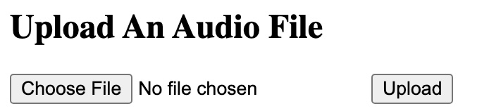
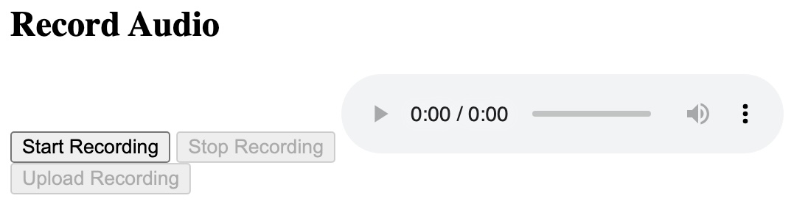
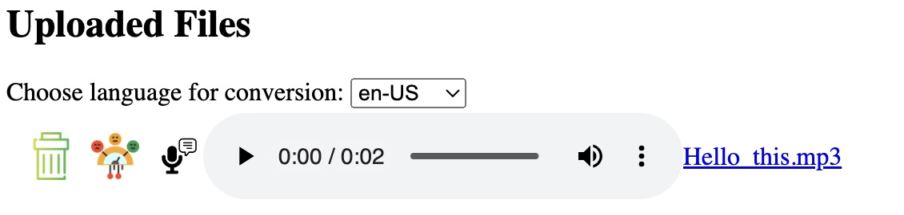
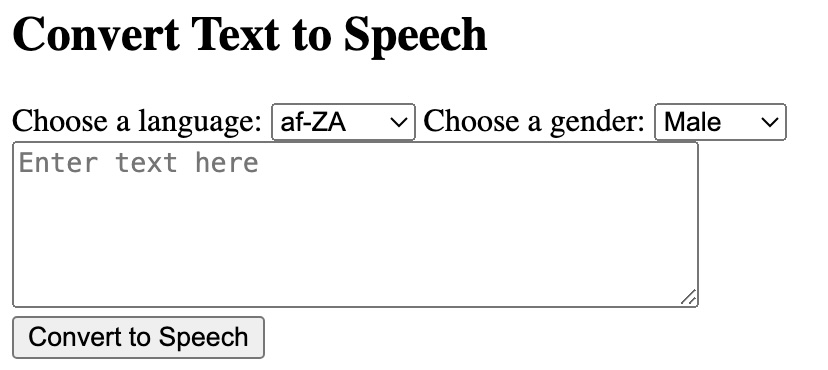
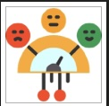
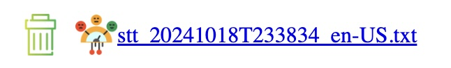

# COT 5930 Project 3

Student: Chris Logan  
Email: loganc2023@fau.edu

GCP Project Name: cot5390project1  
GCP Project ID: https://console.cloud.google.com/welcome/new?project=cot5390project1  
Github Repo: https://github.com/christopherjlogan/cot5390_project1  
App URL: https://cot5390project1.uc.r.appspot.com/  
* Even those these links say "project1", it contains the functionality for Project 3.

## Assignment Instructions
Build upon your knowledge from project II and make the following adjustments:
- Using the multimodal LLM APIs from Google Cloud, replace the previously used
APIs with a single LLM API
- Your app should, in a single call, ask for a transcript and the sentiment analysis
of the uploaded audio. The response from the LLM should be presented as an
audio response by sending it to the TTS API
- The option for text input is no longer required and should be removed.

Provide a report of your application, architecture, code and design decisions, with a
focus on what you learned.

## Introduction
This project is a proof of concept for the uploading, recording and automated bi-directional conversion of speech and text from a web application.  On project 2, additional functionality includes sentiment analysis.

## Architecture
### Project Planning
#### Project 1
In the implementation of this project, the following steps were followed.  During each of the steps, iterative coding and test took place.
- Researched how to build web apps in Python
- Created and ran basic Flask app on local dev machine
- Added file upload capability storing files on local dev machine
- Added capability to display already uploaded files
- Added speech recording capability
- Researched Google Text-to-Speech API and how to integrate
- Setup Google Cloud Project and IAM permissions
- Added text-to-speech capability
- Researched Google Speech API for speech-to-text
- Added speech-to-text capability
- Added language selection for conversion operations
- Moved code to Github repo
- Refactored code to use Google Cloud Storage for uploaded files
- Setup Google App Engine and Admin
- Setup Google Cloud Build with Trigger on Github Repo branch push
- Tested and troubleshooted application running on Google App Engine

#### Project 2
In the implementation of Project 2, the following steps were followed.  I followed the following steps:
- Evaluated the shortcomings of project 1 architecture
- Researched how to build Single Page Architecture (SPA) app using Python and JavaScript
- Created and referenced JavaScript and Cascading Style Sheet (CSS)
- Refactored HTML page and python app for SPA
- Researched Language API usage for sentiment detection
- Enabled Language API
- Implemented sentiment detection API call
- Added delete file API call
- Enabled file deletion from web page
- Designed and implemented extracting sentiment from uploaded sentiment files

#### Project 3
Done:
- Evaluated the shortcomings of project 2 architecture
- Researched how to use the multimodal LLM API
- Removed text-to-speech functionality

To-Do:
- Change audio file upload to use LLM API for speech-to-text and sentiment analysis
- Change audio recording to use LLM API for speech-to-text and sentiment analysis
- Play audio transcription and sentiment response in browser using TTS API
- Implement feedback from grader: "sentiment analysis should be triggered from python at upload time - not js"
- Implement feedback from grader: "please make links clickable"
- Disable/remove unused functionality

### Solution Components


## Implementation Details
### Python Web Application
The application's user interface and back-end business logic is implemented in Python within a Flask app.  
Dependencies: 
- Flask - for defining app endpoints and template generation
- gunicorn and werkzeug - for running the Flask app
- Google Cloud APIs - these APIs are discussed later in this section

Files: 
```
- credentials
 - service-account.json (secret not stored in source code repo)
- static
 - img
  - negative.png
  - neutral.png
  - positive.png
  - sentiment-analysis.png
  - trash.png
 - app.js
 - styles.css
- templates
  - index.html
- README.md
- app.py
- app.yaml
- cloudbuild.yaml
- requirements.txt
```

### Google App Engine
Runs the Python web application.  Configured to give the service account access to deploy applications.
### Google Cloud Storage API
Storing speech audio files.  Google Cloud Storage is needed because Google App Engine cannot store persistently store files.  Converts text into speech audio.  Converts text into speech audio.  Configured to give access to the Google Cloud project service account.  Configured to give public access to the stored files since users are not authenticated.
### Google Speech API
Converts speech audio files into text.  Converts text into speech audio.  Configured to give access to the Google Cloud project service account.
### Google Text-To-Speech API
Converts text into speech audio.  Configured to give access to the Google Cloud project service account.
### Google Language API
Detects sentiment of provided text. Configured to give access to the Google Cloud project service account.
### Google Cloud Build
Automatically builds and deploys the application to Google App Engine.  Configured to trigger off a GitHut repo push.
### GitHub
Stores source code.  Configured as a public repo for sharing for grading.

## Pros and Cons
Discuss what are the problems of this solution, assuming it needs to handle multiple users and scale as discussed in class. Discuss what are the advantages of this solution as implemented in this project.
### Pros
1. Using Single Page Architecture with REST APIs created a separation of concerns making UI and API more flexible.
2. Using Google Cloud Build with push triggers allows for continuous deployment of the code.
3. Using Google Cloud Storage makes the application ephemeral and therefore more fault tolerant.
4. Using Google App Engine, the application can be scaled since it is stateless.

### Cons
1. The current architecture only supports a single user because all of the uploaded files are stored in a single cloud storage bucket without user segmentation.
2. The user interface is very basic and would not work well with many features.
3. No tests are implemented so testing the application required deploying and troubleshooting.
4. More effective error handling should be implemented
5. It is confusing that the cloud project, repo and other resources are named as "project 1"
6. The file sentiments should be stored in a database ideally

## Problems Encountered and Solutions
1. Refactoring to SPA took significant refactoring of both front and back-ends of the application.
2. It took several iterations to understand how to use the Language API for sentiment detection
3. It was challening to extract the previously detected file sentiment.

## Application Instructions
1. Uploading Speech Audio Files
   - To upload a file, click the "Choose File" button and select the audio file.  Once selected, click the Upload button.  

2. Recording Speech Audio
   - To record speech, click the "Start Recording" button
   - Once done speaking, click the "Stop Recording" button
   - Click the "Upload Recording" button to upload your recorded audio  

3. Playing Uploaded Speech Audio
   - Uploaded audio files are listed under the Uploaded Files section
   - To play previously uploaded audio files, click the play button audio player control  

4. Converting Text to Speech Audio File
   - To convert text to speech, type your message into the textbox and choose the language and gender for conversion
   - Click the "Convert to Speech" button 
   - The converted text is stored as a file which can be downloaded in the Uploaded Files

5. Converting Speech Audio File to Text
   - Select the target language: 
   - Next to the desired audio file, click the  button
   - The converted text is stored as a file which can be downloaded in the Uploaded Files
6. Detecting Sentiment
   - Click the  icon next to the desired file
   - Based upon the detected sentiment, the icon will change according:
   -  = POSITIVE
   -  = NEGATIVE
   -  = NEUTRAL
   - A text file will be created with the name of the analyzed file appended with '_sentiment.txt'
7. Download Audio File
   - To download an uploaded audio file, click the link on the name of the file to download it.

8. Download Text File
   - To download a text file, click the link on the name of the file to download it.

9. Delete Uploaded File
   - To delete a file, click the  icon next to the file
   - The list of files will refresh

## Lessons Learned
1. An indicator is needed on the front-end to indicate that the REST API call is processing
2. How to use the JavaScript console in Chrome to troubleshoot API call issues
3. How to use maps JavaScript
