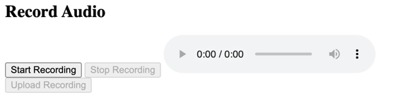
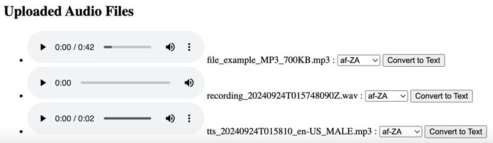
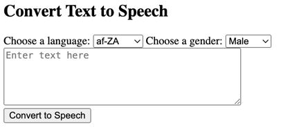
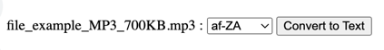

# COT 5930 Project 2

Student: Chris Logan  
Email: loganc2023@fau.edu

GCP Project Name: cot5390project1  
GCP Project ID: https://console.cloud.google.com/welcome/new?project=cot5390project1  
Github Repo: https://github.com/christopherjlogan/cot5390_project1  
App URL: https://cot5390project1.uc.r.appspot.com/  

## Required Functionality
### Proj 1
1. Upload an audio file - DONE
2. Record an audio file - DONE
3. Generate speech audio file from user-entered text - DONE
4. Generate and store text file from previously uploaded audio file - IN PROGRESS
5. Display list of uploaded files - DONE
6. Allow supported languages to be selected when doing transcription - DONE
7. Play audio files from the list - DONE
8. Display text files from the list - DONE

### Proj 2
1. Display the sentiment of the uploaded audio or text files (positive/neutral/negative) - IN PROGRESS

### Optional
1. Add a control to delete uploaded files

## Assignment Instructions
Build upon your knowledge from project I and make the following adjustments:
- Leverage the Language API in Google Cloud to evaluate the sentiment of the
audio or text uploaded
- Display whether the text has a positive/neutral/negative connotation

Provide a report of your application, architecture, code and design decisions, with a
focus on what you learned.

## Introduction
This project is a proof of concept for the uploading, recording and automated bi-directional conversion of speech and text from a web application.

## Architecture
### Project Planning
In the implementation of this project, the following steps were followed.  During each of the steps, iterative coding and test took place.
- Researched how to build web apps in Python
- Created and ran basic Flask app on local dev machine
- Added file upload capability storing files on local dev machine
- Added capability to display already uploaded files
- Added speech recording capability
- Researched Google Text-to-Speech API and how to integrate
- Setup Google Cloud Project and IAM permissions
- Added text-to-speech capability
- Researched Google Speech API for speech-to-text
- Added speech-to-text capability
- Added language selection for conversion operations
- Moved code to Github repo
- Refactored code to use Google Cloud Storage for uploaded files
- Setup Google App Engine and Admin
- Setup Google Cloud Build with Trigger on Github Repo branch push
- Tested and troubleshooted application running on Google App Engine

### Solution Components


## Implementation Details
### Python Web Application
The application's user interface and back-end business logic is implemented in Python within a Flask app.  
Dependencies: 
- Flask - for defining app endpoints and template generation
- gunicorn and werkzeug - for running the Flask app
- Google Cloud APIs - these APIs are discussed later in this section

Files: 
```
- credentials
 - service-account.json
- templates
  - index.html
- app.py
- app.yaml
- cloudbuild.yaml
- README.MD
- requirements.txt
```

### Google App Engine
Runs the Python web application.  Configured to give the service account access to deploy applications.
### Google Cloud Storage API
Storing speech audio files.  Google Cloud Storage is needed because Google App Engine cannot store persistently store files.  Converts text into speech audio.  Converts text into speech audio.  Configured to give access to the Google Cloud project service account.  Configured to give public access to the stored files since users are not authenticated.
### Google Speech API
Converts speech audio files into text.  Converts text into speech audio.  Configured to give access to the Google Cloud project service account.
### Google Text-To-Speech API
Converts text into speech audio.  Configured to give access to the Google Cloud project service account.
### Google Cloud Build
Automatically builds and deploys the application to Google App Engine.  Configured to trigger off a GitHut repo push.
### GitHub
Stores source code.  Configured as a public repo for sharing for grading.

## Pros and Cons
Discuss what are the problems of this solution, assuming it needs to handle multiple users and scale as discussed in class. Discuss what are the advantages of this solution as implemented in this project.
### Pros
1. Using Google Cloud Build with push triggers allows for continuous deployment of the code.
2. Using Google Cloud Storage makes the application ephemeral and therefore more fault tolerant.
3. Using Google App Engine, the application can be scaled since it is stateless.

### Cons
1. The current architecture only supports a single user because all of the uploaded files are stored in a single cloud storage bucket without user segmentation.
2. The user interface is very basic and would not work well with many features.
3. By using Flask, the front-end and back-end are tied together.  This could be improved upon by using REST APIs in the back-end.
4. No tests are implemented so testing the application required deploying and troubleshooting.

## Problems Encountered and Solutions
1. Google API calls from locally-running application took a lot of research.  I eventually downloaded a service account secret that is only used when running locally.
2. The refactoring from local to cloud file storage took some significant refactoring.  I eventually moved the entire application to cloud storage and removed directories.
3. I ran into many issues with permissions that I had to overcome through troubleshooting.

## Application Instructions
1. Uploading Speech Audio Files
   - To upload a file, click the "Choose File" button and select the audio file.  Once selected, click the Upload button.  

2. Recording Speech Audio
   - To record speech, click the "Start Recording" button
   - Once done speaking, click the "Stop Recording" button
   - Click the "Upload Recording" button to upload your recorded audio  

3. Playing Uploaded Speech Audio
   - Uploaded audio files are listed under the Uploaded Audio Files section
   - To play previously uploaded audio files, click the play button audio player control  

4. Converting Text to Speech Audio File
   - To convert text to speech, type your message into the textbox and choose the language and gender for conversion
   - Click the "Convert to Speech" button  

5. Converting Speech Audio File to Text
   - Next to the desired audio file, select the target language and click the "Convert to Text" button  


## Lessons Learned
1. Don't store files locally.
2. Service account permissions need to be managed carefully.
3. Secrets cannot be stored in either GitHub or Google Cloud.
4. How to use app.yaml for building a Flask app.
5. How to use Google Cloud Build.

## Appendix
### index.html
```html
<html lang="en">
<head>
    <meta charset="UTF-8">
    <meta name="viewport" content="width=device-width, initial-scale=1.0">
    <title>Audio Recording and Transcription</title>
</head>
<body>
    <h1>COT5390 Project 1 - Chris Logan</h1>
    <h2>Upload an Audio File, Record Audio, and Bi-Directional Text/Speech Conversion</h2>

    <!-- Audio file upload form -->
    <form action="/upload" method="POST" enctype="multipart/form-data">
        <input type="file" name="file" accept=".mp3, .wav, .ogg" required>
        <button type="submit">Upload</button>
    </form>

    <h2>Record Audio</h2>

    <!-- Audio recorder interface -->
    <button id="startRecord">Start Recording</button>
    <button id="stopRecord" disabled>Stop Recording</button>
    <audio id="audioPlayback" controls></audio>
    <br>
    <button id="uploadRecord" disabled>Upload Recording</button>

    <h2>Convert Text to Speech</h2>
    <form action="/text-to-speech" method="POST">
        <label for="language">Choose a language:</label>
        <select name="language" id="language" required>
            
                <option value="{{ language }}">{{ language }}</option>
            
        </select>
        <label for="gender">Choose a gender:</label>
        <select name="gender" id="gender" required>
            <option value="MALE">Male</option>
            <option value="FEMALE">Female</option>
        </select>
        <br>
        <textarea name="text" rows="5" cols="40" placeholder="Enter text here" required></textarea>
        <br>
        <button type="submit">Convert to Speech</button>
    </form>

    <h2>Uploaded Audio Files</h2>
    
        <h3>Selected Speech to Text Transcription:</h3>{{ transcript }}
    
    <ul>
        
        <li>
            <audio controls>
                <source src="{{  file }}" type="audio/mpeg">
                Your browser does not support the audio element.
            </audio>
            {{ file[file.rindex('/') + 1:] }}
             <form action="/speech-to-text" method="POST" style="display:inline;">
                <input type="hidden" name="filename" value="{{ file }}">
                <label for="language">:</label>
                <select name="language" id="language" required>
                    
                        <option value="{{ language }}">{{ language }}</option>
                    
                </select>
                <button type="submit">Convert to Text</button>
            </form>
        </li>
        
    </ul>

    <script>
        let mediaRecorder;
        let audioChunks = [];
        let audioBlob;

        const startRecordBtn = document.getElementById('startRecord');
        const stopRecordBtn = document.getElementById('stopRecord');
        const uploadRecordBtn = document.getElementById('uploadRecord');
        const audioPlayback = document.getElementById('audioPlayback');

        startRecordBtn.addEventListener('click', async () => {
            // Start audio recording
            const stream = await navigator.mediaDevices.getUserMedia({ audio: true });
            mediaRecorder = new MediaRecorder(stream);
            mediaRecorder.start();

            mediaRecorder.ondataavailable = (event) => {
                audioChunks.push(event.data);
            };

            mediaRecorder.onstop = () => {
                audioBlob = new Blob(audioChunks, { type: 'audio/wav' });
                audioChunks = [];
                const audioURL = URL.createObjectURL(audioBlob);
                audioPlayback.src = audioURL;
                uploadRecordBtn.disabled = false;
            };

            startRecordBtn.disabled = true;
            stopRecordBtn.disabled = false;
        });

        stopRecordBtn.addEventListener('click', () => {
            // Stop audio recording
            mediaRecorder.stop();
            startRecordBtn.disabled = false;
            stopRecordBtn.disabled = true;
        });

        uploadRecordBtn.addEventListener('click', () => {
            // Create a timestamp-based filename for the recording
            const timestamp = new Date().toISOString().replace(/[-:.]/g, '');
            const filename = `recording_${timestamp}.wav`;

            // Upload the recorded audio
            const formData = new FormData();
            formData.append('file', audioBlob, filename);

            fetch('/upload', {
                method: 'POST',
                body: formData
            }).then(response => {
                if (response.ok) {
                    alert('Recording uploaded successfully');
                    window.location.reload();
                } else {
                    alert('Failed to upload recording');
                }
            }).catch(() => {
                alert('Error during upload');
            });
        });
    </script>
</body>
</html>
```

### app.py
```python
import os
import io
from flask import Flask, render_template, request, redirect, url_for, send_from_directory, session
from werkzeug.utils import secure_filename
from datetime import datetime
from typing import Sequence
from google.oauth2 import service_account
from google.cloud import storage, speech, texttospeech
app = Flask(__name__)
app.secret_key = 'COT5930'
SERVICE_ACCOUNT_FILE = "credentials/service-account.json"
if os.path.exists(SERVICE_ACCOUNT_FILE):
    RUN_LOCALLY = True
    print("Service account file found, loading credentials...")
    credentials = service_account.Credentials.from_service_account_file(SERVICE_ACCOUNT_FILE)
    ttsclient = texttospeech.TextToSpeechClient(credentials=credentials)
    sttclient = speech.SpeechClient(credentials=credentials)
    gcsclient = storage.Client(credentials=credentials)
else:
    RUN_LOCALLY = False
    print("No service account file found, using Application Default Credentials (ADC)...")
    # Use Application Default Credentials (ADC)
    ttsclient = texttospeech.TextToSpeechClient()
    sttclient = speech.SpeechClient()
    gcsclient = storage.Client()
BUCKET_NAME = 'cot5390project1.appspot.com'
ALLOWED_EXTENSIONS = {'wav', 'mp3', 'ogg'}
def allowed_file(filename):
    return '.' in filename and filename.rsplit('.', 1)[1].lower() in ALLOWED_EXTENSIONS
def get_uploaded_files():
    bucket = gcsclient.get_bucket(BUCKET_NAME)  # Get the bucket
    blobs = bucket.list_blobs()  # List files with the folder path prefix
    files = []
    for blob in blobs:
        # Exclude the folder itself from the list, only add files
        if not blob.name.endswith("/"):
            files.append(blob.public_url)
    return files
def upload_to_cloud_storage(audio_content, filename):
    bucket = gcsclient.bucket(BUCKET_NAME)
    blob = bucket.blob(filename)
    blob.upload_from_string(audio_content)
    return blob.public_url
def unique_languages_from_voices(voices: Sequence[texttospeech.Voice]):
    language_list = []
    for voice in voices:
        for language_code in voice.language_codes:
            if language_code not in language_list:  # Check for uniqueness
                language_list.append(language_code)
    return language_list
def list_languages():
    response = ttsclient.list_voices()
    languages = unique_languages_from_voices(response.voices)
    return languages
@app.route('/')
def index():
    # Get the list of uploaded audio files
    files = get_uploaded_files()
    languages = list_languages()
    transcript = session.pop('transcript', '')
    return render_template('index.html', files=files, languages=languages, transcript=transcript)
@app.route('/upload', methods=['POST'])
def upload_file():
    if 'file' not in request.files:
        return redirect(request.url)
    file = request.files['file']
    if file and allowed_file(file.filename):
        # Use a timestamp-based filename
        #timestamp = datetime.now().strftime("%Y%m%dT%H%M%S")
        #ext = file.filename.rsplit('.', 1)[1].lower()  # Get file extension
        #filename = f"recording_{timestamp}.{ext}"
        filename = secure_filename(file.filename)  # Secure the filename
        public_url = upload_to_cloud_storage(file.read(), filename)
    return redirect(url_for('index'))
@app.route('/text-to-speech', methods=['POST'])
def text_to_speech():
    text_input = request.form['text']
    selected_language = request.form['language']
    selected_gender = request.form['gender']
    synthesis_input = texttospeech.SynthesisInput(text=text_input)
    voice = texttospeech.VoiceSelectionParams(
        language_code=selected_language,
        ssml_gender=selected_gender
    )
    # Select the audio format
    audio_config = texttospeech.AudioConfig(
        audio_encoding=texttospeech.AudioEncoding.MP3
    )
    # Perform the text-to-speech request
    response = ttsclient.synthesize_speech(
        input=synthesis_input, voice=voice, audio_config=audio_config
    )
    # Save the audio file
    timestamp = datetime.now().strftime("%Y%m%dT%H%M%S")
    filename = f"tts_{timestamp}_{selected_language}_{selected_gender}.mp3"
    upload_to_cloud_storage(response.audio_content, filename)
    return redirect(url_for('index'))
def download_blob_as_bytes(bucket_name, blob_name):
    print("Downloading blob", blob_name, "from bucket", bucket_name)
    bucket = gcsclient.get_bucket(bucket_name)
    blob = bucket.blob(blob_name)
    bytes = blob.download_as_bytes()
    return bytes
@app.route('/speech-to-text', methods=['POST'])
def speech_to_text():
    filename = request.form['filename']
    language = request.form['language']
    print("Converting", filename, "to", language)
    audio_content = download_blob_as_bytes(BUCKET_NAME, filename[filename.rindex('/') + 1:])
    audio = speech.RecognitionAudio(content=audio_content)
    config = speech.RecognitionConfig(
        encoding=speech.RecognitionConfig.AudioEncoding.MP3,  # Adjust based on your file type (MP3 assumed here)
        sample_rate_hertz=16000,  # Adjust if necessary
        language_code=language
    )
    response = sttclient.recognize(config=config, audio=audio)
    transcript = ""
    for result in response.results:
        transcript += result.alternatives[0].transcript
    print(f"Transcribed text for {filename}: {transcript}")
    session['transcript'] = transcript  # Store transcript in session
    return redirect(url_for('index'))
@app.route('/uploads/<filename>')
def uploaded_file(filename):
    return send_from_directory(filename)
if __name__ == '__main__':
    app.run(debug=True)
```

### app.yaml
```yaml
runtime: python39  # Specify the Python runtime

entrypoint: gunicorn -b :$PORT app:app  # Use Gunicorn to run your Flask app

# Ensure the static directory is correctly mapped
handlers:
  - url: /static
    static_dir: static

  - url: /.*
    script: auto

# Optional: Environment variables
env_variables:
  FLASK_ENV: 'production'
```

### cloudbuild.yaml
```yaml
steps:
  # Install dependencies
  - name: 'python:3.9-slim'
    id: 'Install dependencies'
    entrypoint: 'bash'
    args:
      - '-c'
      - |
        pip install --upgrade pip
        pip install -r requirements.txt

  # Deploy to Google App Engine
  - name: 'gcr.io/google.com/cloudsdktool/cloud-sdk'
    id: 'Deploy to App Engine'
    entrypoint: 'bash'
    args:
      - '-c'
      - |
        gcloud app deploy app.yaml --quiet

options:
  logging: CLOUD_LOGGING_ONLY
```

### requirements.txt
```
Flask==3.0.3
gunicorn
google-cloud-texttospeech
google-cloud-speech
google-cloud-storage
werkzeug~=3.0.4
protobuf~=5.28.2
```
